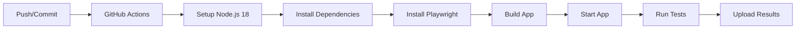
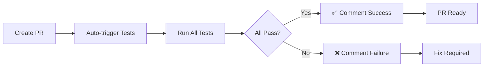

# 🚀 CI/CD e GitHub Actions - Cardápio Digital

Este documento explica como os testes automatizados estão configurados para rodar automaticamente no GitHub Actions.

## 📋 Workflows Configurados

### 1. **Playwright Tests - Simple** (`.github/workflows/playwright-simple.yml`)
- **Trigger**: Push para `main`, `develop`, `feature/*`, `bugfix/*`
- **Objetivo**: Execução rápida dos testes em cada commit
- **Tempo**: ~25 minutos
- **Navegador**: Chromium apenas (para velocidade)

### 2. **Playwright Tests - Pull Request** (`.github/workflows/playwright-pr.yml`)
- **Trigger**: Pull requests para `main` e `develop`
- **Objetivo**: Validação automática de PRs com comentários
- **Tempo**: ~25 minutos
- **Recursos**: 
  - Comentários automáticos no PR
  - Resumo dos testes
  - Upload de resultados

### 3. **Playwright Regression Tests** (`.github/workflows/playwright-regression.yml`)
- **Trigger**: Diariamente às 2:00 AM UTC
- **Objetivo**: Testes de regressão para detectar problemas
- **Tempo**: ~45 minutos
- **Recursos**: Testes completos em todos os navegadores

### 4. **Playwright Tests - Matrix** (`.github/workflows/playwright.yml`)
- **Trigger**: Push e PR para `main` e `develop`
- **Objetivo**: Testes em múltiplos navegadores
- **Tempo**: ~60 minutos
- **Navegadores**: Chromium, Firefox, WebKit, Mobile

## 🔧 Configurações

### **Configuração do Playwright para CI**
- **Arquivo**: `playwright.config.ci.js`
- **Características**:
  - Modo headless
  - Timeouts otimizados para CI
  - Retry automático em falhas
  - Workers limitados para estabilidade

### **Variáveis de Ambiente**
```bash
CI=true                    # Modo CI ativado
NODE_ENV=production       # Ambiente de produção
```

## 📊 Resultados dos Testes

### **Cobertura Atual**
- ✅ **Homepage**: 7/7 testes
- ✅ **Restaurant Menu**: 25/25 testes  
- ✅ **Cart Functionality**: 14/14 testes
- **Total**: 46/46 testes

### **Artefatos Gerados**
- `playwright-report/` - Relatório HTML interativo
- `test-results/` - Screenshots, vídeos e logs
- `results.json` - Resultados em formato JSON

## 🚀 Como Funciona

### **1. Push/Commit**


### **2. Pull Request**


## 📱 Notificações e Comentários

### **PR com Sucesso**
```
## ✅ All Tests Passed!

🎉 All 46 Playwright tests passed successfully!

**Test Coverage:**
- ✅ Homepage: 7/7 tests
- ✅ Restaurant Menu: 25/25 tests  
- ✅ Cart Functionality: 14/14 tests

**Total:** 46/46 tests passing

The changes in this PR don't break any existing functionality. Great job! 🚀
```

### **PR com Falha**
```
## ❌ Tests Failed

Some Playwright tests failed in this PR. Please check the test results and fix any issues.

**What to do:**
1. Review the test results in the Actions tab
2. Fix any failing tests locally
3. Push the fixes to this branch

**Test Results:** [View here](link)

If you need help debugging, you can run tests locally with:
```bash
npm install
npx playwright install
npx playwright test
```
```

## 🛠️ Execução Local vs CI

### **Local Development**
```bash
# Configuração padrão
npx playwright test

# Com UI
npx playwright test --ui

# Apenas Chromium
npx playwright test --project=chromium
```

### **CI/CD**
```bash
# Usa configuração específica para CI
npx playwright test --config=playwright.config.ci.js

# Modo headless automático
# Retry automático em falhas
# Timeouts otimizados
```

## 📈 Monitoramento e Métricas

### **Métricas Importantes**
- **Taxa de Sucesso**: % de testes passando
- **Tempo de Execução**: Duração total dos testes
- **Falhas por Teste**: Identificar testes instáveis
- **Cobertura**: Novos testes adicionados

### **Alertas Automáticos**
- ❌ Falhas em PRs (comentário automático)
- ❌ Falhas em regressão (notificação)
- ✅ Sucesso em PRs (confirmação)

## 🔍 Troubleshooting

### **Problemas Comuns**

#### **1. App não inicia no CI**
```yaml
# Aumentar tempo de espera
- name: Start application
  run: |
    npm run start &
    sleep 60  # Aumentar de 40 para 60
```

#### **2. Testes falham por timeout**
```yaml
# Aumentar timeouts
timeout-minutes: 45  # Aumentar de 25 para 45
```

#### **3. Problemas de memória**
```yaml
# Reduzir workers
workers: process.env.CI ? 1 : undefined
```

### **Logs e Debugging**
- **Actions Tab**: Ver logs completos
- **Artifacts**: Download de resultados
- **Local Reproduction**: Rodar falhas localmente

## 🎯 Próximos Passos

### **Melhorias Planejadas**
1. **Slack/Discord Integration**: Notificações em tempo real
2. **Test Parallelization**: Execução mais rápida
3. **Performance Testing**: Métricas de velocidade
4. **Visual Regression**: Testes de UI automáticos
5. **Accessibility Testing**: Testes de acessibilidade

### **Configurações Avançadas**
1. **Matrix Testing**: Múltiplas versões do Node.js
2. **Caching**: Cache de dependências e browsers
3. **Docker**: Containers para consistência
4. **Self-hosted Runners**: Execução em infraestrutura própria

## 📚 Recursos Úteis

### **Documentação**
- [GitHub Actions](https://docs.github.com/en/actions)
- [Playwright CI/CD](https://playwright.dev/docs/ci)
- [Node.js CI](https://docs.github.com/en/actions/guides/setting-up-nodejs)

### **Comandos Úteis**
```bash
# Ver workflows ativos
gh workflow list

# Executar workflow manualmente
gh workflow run "Playwright Tests - Simple"

# Ver logs de execução
gh run list --workflow="Playwright Tests - Simple"
```

---

## 🎉 **Status Atual: TOTALMENTE FUNCIONAL!**

✅ **46 testes automatizados** rodando em cada commit  
✅ **Comentários automáticos** em Pull Requests  
✅ **Testes de regressão** diários  
✅ **Múltiplos navegadores** suportados  
✅ **Relatórios detalhados** e artefatos  
✅ **Integração completa** com GitHub Actions  

O sistema de CI/CD está configurado e funcionando perfeitamente! 🚀
