# 🚀 Cardápio Digital - CI/CD e Testes Automatizados

[](https://github.com/{owner}/{repo}/actions/workflows/playwright-simple.yml)
[](https://github.com/{owner}/{repo}/actions)

Este projeto implementa um sistema completo de testes automatizados para o cardápio digital, integrado com GitHub Actions para CI/CD contínuo.

## 🎯 **Status dos Testes**

- ✅ **Homepage**: 7/7 testes passando
- ✅ **Restaurant Menu**: 25/25 testes passando  
- ✅ **Cart Functionality**: 14/14 testes passando
- **Total**: **46/46 testes** - **100% de sucesso!**

## 🚀 **Execução Automática**

### **GitHub Actions Workflows**

| Workflow | Trigger | Objetivo | Tempo |
|----------|---------|----------|-------|
| **Playwright Tests - Simple** | Push/Commit | Testes rápidos | ~25min |
| **Playwright Tests - PR** | Pull Request | Validação de PRs | ~25min |
| **Playwright Regression** | Diário (2AM UTC) | Testes de regressão | ~45min |
| **Playwright Matrix** | Push/PR | Múltiplos navegadores | ~60min |

### **Execução Local**

```bash
# Instalar dependências
npm install

# Instalar Playwright
npx playwright install

# Executar todos os testes
npx playwright test

# Executar com interface visual
npx playwright test --ui

# Executar apenas Chromium (mais rápido)
npx playwright test --project=chromium
```

## 📋 **Funcionalidades Testadas**

### **🏠 Homepage**
- ✅ Carregamento da página
- ✅ Header e navegação
- ✅ Carrossel de funcionalidades
- ✅ Seções de destaque
- ✅ Responsividade

### **🍽️ Cardápio dos Restaurantes**
- ✅ Carregamento de múltiplos restaurantes
- ✅ Carrossel de pratos em destaque
- ✅ Sistema de categorias
- ✅ Lista de pratos
- ✅ Modal de detalhes
- ✅ Funcionalidade de busca
- ✅ Botões de chamar garçom e WhatsApp
- ✅ Responsividade e acessibilidade

### **🛒 Funcionalidades do Carrinho**
- ✅ Adição de itens (simples e com complementos)
- ✅ Gerenciamento de quantidade
- ✅ Remoção de itens
- ✅ Cálculo de preços
- ✅ Limpeza do carrinho
- ✅ Persistência entre páginas

## 🔧 **Configuração**

### **Arquivos de Configuração**

- `playwright.config.cjs` - Configuração local/desenvolvimento
- `playwright.config.ci.js` - Configuração otimizada para CI/CD
- `.github/workflows/` - Workflows do GitHub Actions

### **Variáveis de Ambiente**

```bash
# Local
NODE_ENV=development

# CI/CD
CI=true
NODE_ENV=production
```

## 📊 **Relatórios e Resultados**

### **Artefatos Gerados**
- 📁 `playwright-report/` - Relatório HTML interativo
- 📁 `test-results/` - Screenshots, vídeos e logs
- 📄 `results.json` - Resultados em formato JSON

### **Acesso aos Resultados**
1. **GitHub Actions Tab** → Ver logs e status
2. **Artifacts** → Download de resultados
3. **Local** → `npx playwright show-report`

## 🚀 **CI/CD Pipeline**

### **Fluxo Automático**

```mermaid
graph LR
    A[Push/Commit] --> B[GitHub Actions]
    B --> C[Setup Environment]
    C --> D[Install Dependencies]
    D --> E[Install Playwright]
    E --> F[Build Application]
    F --> G[Start Application]
    G --> H[Run Tests]
    H --> I[Generate Reports]
    I --> J[Upload Results]
    J --> K[Update Badges]
```



### **Pull Request Automation**

- ✅ **Testes automáticos** em cada PR
- 💬 **Comentários automáticos** com resultados
- 📊 **Resumo detalhado** da cobertura
- 🚫 **Bloqueio de merge** se testes falharem

## 📈 **Monitoramento**

### **Métricas Importantes**
- **Taxa de Sucesso**: 100% (46/46)
- **Tempo de Execução**: ~25-60 minutos
- **Cobertura**: Funcionalidades principais
- **Estabilidade**: Retry automático em falhas

### **Alertas Automáticos**
- ❌ **Falhas em PRs** → Comentário automático
- ❌ **Falhas em regressão** → Notificação
- ✅ **Sucesso em PRs** → Confirmação automática

## 🛠️ **Troubleshooting**

### **Problemas Comuns**

#### **1. App não inicia no CI**
```yaml
# Aumentar tempo de espera
- name: Start application
  run: |
    npm run start &
    sleep 60  # Aumentar de 40 para 60
```

#### **2. Testes falham por timeout**
```yaml
# Aumentar timeouts
timeout-minutes: 45  # Aumentar de 25 para 45
```

#### **3. Problemas de memória**
```yaml
# Reduzir workers
workers: process.env.CI ? 1 : undefined
```

### **Debugging Local**
```bash
# Reproduzir falhas localmente
npx playwright test --grep "nome do teste"

# Executar em modo debug
npx playwright test --debug

# Ver logs detalhados
DEBUG=pw:api npx playwright test
```

## 🎯 **Próximos Passos**

### **Melhorias Planejadas**
1. **Slack/Discord Integration** - Notificações em tempo real
2. **Performance Testing** - Métricas de velocidade
3. **Visual Regression** - Testes de UI automáticos
4. **Accessibility Testing** - Testes de acessibilidade
5. **Mobile Testing** - Testes específicos para mobile

### **Configurações Avançadas**
1. **Matrix Testing** - Múltiplas versões do Node.js
2. **Caching** - Cache de dependências e browsers
3. **Docker** - Containers para consistência
4. **Self-hosted Runners** - Execução em infraestrutura própria

## 📚 **Recursos e Documentação**

### **Links Úteis**
- [GitHub Actions](https://docs.github.com/en/actions)
- [Playwright CI/CD](https://playwright.dev/docs/ci)
- [Node.js CI](https://docs.github.com/en/actions/guides/setting-up-nodejs)

### **Comandos GitHub CLI**
```bash
# Ver workflows ativos
gh workflow list

# Executar workflow manualmente
gh workflow run "Playwright Tests - Simple"

# Ver logs de execução
gh run list --workflow="Playwright Tests - Simple"

# Ver status de um run específico
gh run view {run-id}
```

## 🎉 **Status Atual**

### **✅ TOTALMENTE FUNCIONAL!**

- 🧪 **46 testes automatizados** rodando em cada commit
- 🤖 **Comentários automáticos** em Pull Requests
- 📅 **Testes de regressão** diários
- 🌐 **Múltiplos navegadores** suportados
- 📊 **Relatórios detalhados** e artefatos
- 🚀 **Integração completa** com GitHub Actions

### **🎯 Benefícios Alcançados**

1. **Qualidade Garantida**: Todos os testes passando
2. **Feedback Rápido**: Resultados em ~25 minutos
3. **Prevenção de Regressões**: Detecção automática de problemas
4. **Documentação Viva**: Testes como especificação
5. **Confiança no Deploy**: Validação automática antes do merge

---

## 🚀 **Como Contribuir**

1. **Fork** o repositório
2. **Crie** uma branch para sua feature
3. **Implemente** suas mudanças
4. **Execute** os testes localmente
5. **Crie** um Pull Request
6. **Aguarde** a validação automática dos testes

**Os testes rodarão automaticamente e você receberá feedback imediato!** 🎉

---

*Este sistema de CI/CD foi configurado para garantir a qualidade e estabilidade do cardápio digital em todas as mudanças.*
